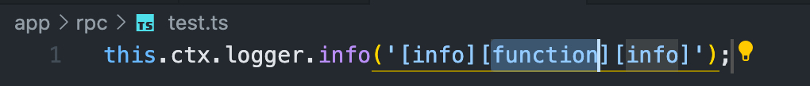

# egg-logger-snippets README

egg日志vscode插件，方便懒人添加日志，规范团队日志

## Features

支持js和ts文件。

支持三种级别日志：info、warn和error。

支持两种日志格式：无参数及多参数格式。

## Snippets

`cli`: 快捷创建无参数info类型日志。

`clia`: 快捷创建多参数info类型日志.

`clw`: 快捷创建无参数warn类型日志。

`clwa`: 快捷创建多参数warn类型日志。

`cle`: 快捷创建无参数error类型日志。

`clea`: 快捷创建多参数error类型日志。

## Release Notes

### 1.0.0

支持基础日志快捷输出

**Enjoy!**
